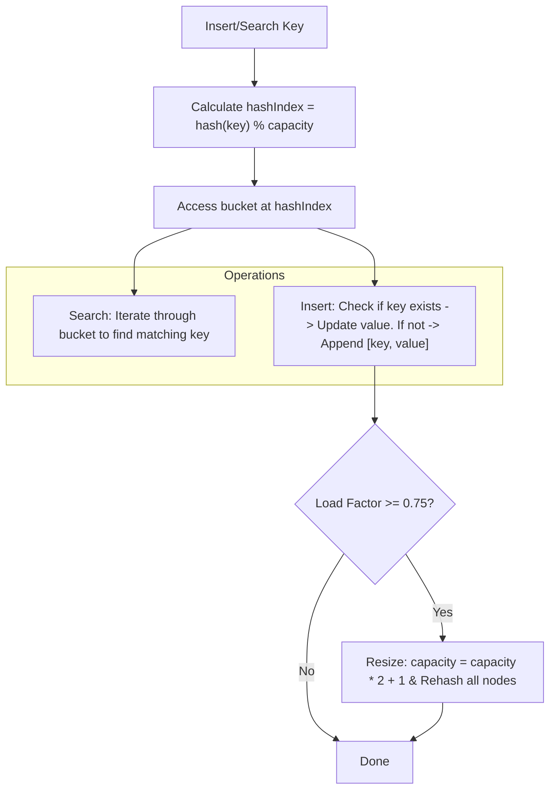
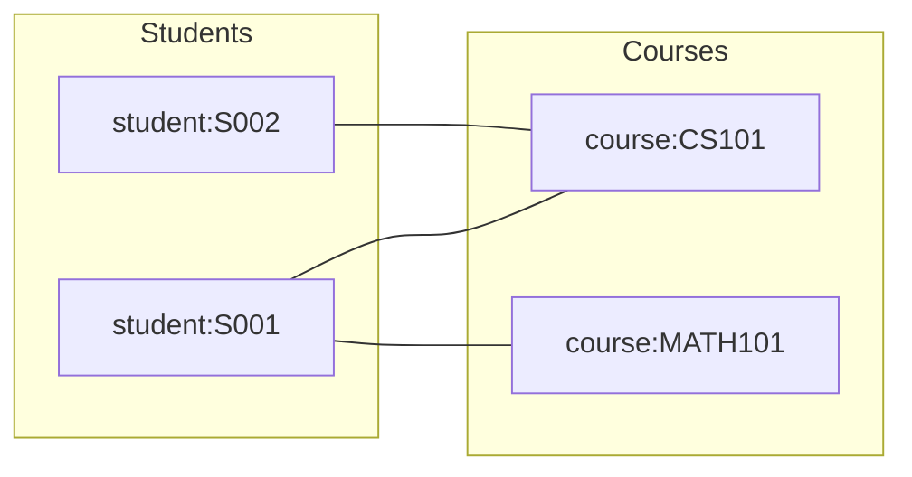
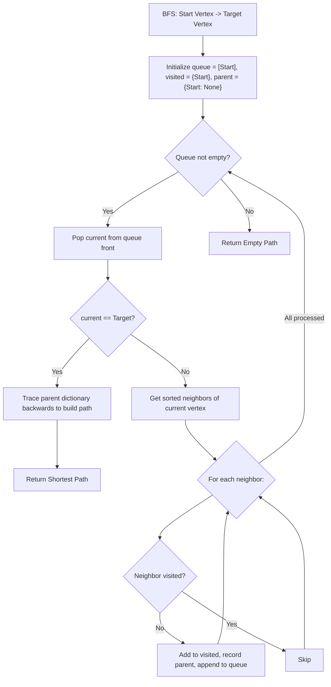
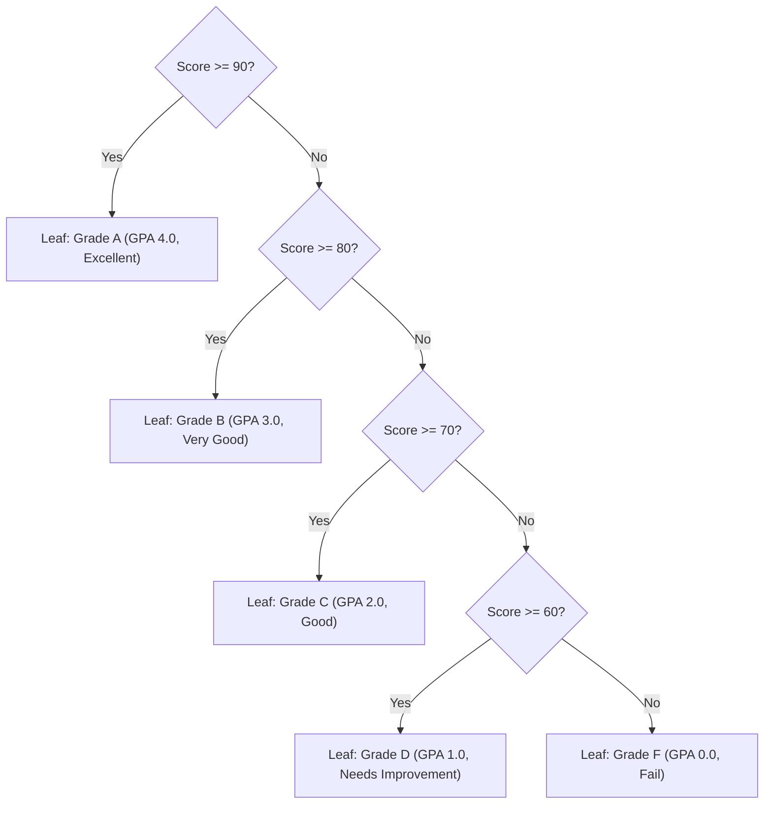

# 🎓 Data Structures and Algorithms Workflow

This document explains the technical workflow, architecture, and logic of the custom data structures and algorithms implemented in the **RUPP ITE Student Management System**. 

The system avoids built-in database tools or dictionaries for relationships and instead implements three classic textbook data structures directly in [student_management.py](file:///c:/Users/CP/Desktop/final/Final-Project-DSA-RUPP-ITE-Management-/data_structures/student_management.py).

---

## 🗺️ High-Level System Architecture

The workflow starts with the console user interface in [main.py](file:///c:/Users/CP/Desktop/final/Final-Project-DSA-RUPP-ITE-Management-/main.py) and coordinates data operations through the `StudentManagementSystem` coordinator, which stores records in memory and saves changes back to [data.py](file:///c:/Users/CP/Desktop/final/Final-Project-DSA-RUPP-ITE-Management-/data.py).

```mermaid
graph TD
    A[Console Interface: main.py] -->|Commands| B[Coordinator: StudentManagementSystem]
    B -->|Fast Lookups O(1)| C[HashTable: Students, Courses, Users]
    B -->|Relationships & Paths| D[Graph: Enrollments]
    B -->|Grade/GPA Translation| E[GradeDecisionTree: Scores]
    B -->|Atomic Persistence| F[data.py File]
```

---

## 🔑 1. Hash Table Workflow (Separate Chaining)

The `HashTable` class is used to store and retrieve core records (`Student`, `Course`, `User`) by their unique keys (`student_id`, `code`, `username`).

### Mechanics & Design
* **Collision Resolution:** Separate chaining using lists of key-value pairs (buckets).
* **Initial Capacity:** `101` (prime number to distribute keys uniformly).
* **Dynamic Rehashing:** Triggers when the load factor ($\text{size} / \text{capacity}$) matches or exceeds `0.75`. The capacity is doubled and offset by 1 ($\text{capacity} \times 2 + 1$), and all elements are rehashed into the new buckets.



### Time Complexity
| Operation | Average Case | Worst Case (Many Collisions) |
| :--- | :--- | :--- |
| **Search** | $O(1)$ | $O(N)$ |
| **Insert** | $O(1)$ | $O(N)$ (requires rehashing when limit hit) |
| **Delete** | $O(1)$ | $O(N)$ |

---

## 🕸️ 2. Enrollment Graph Workflow (Adjacency List)

The undirected `Graph` class is used to map relationships between students and courses. 

### Node Namespace Segregation
To store two different types of entities in a single graph, vertex names are prefixed:
* **Students:** `student:S001`
* **Courses:** `course:CS101`



### Key Graph Algorithms

#### A. Breadth-First Search (BFS) for Shortest Paths
This algorithm finds how two entities are connected (e.g., student to course, student to student via shared courses).



---

## 🌳 3. Grade Decision Tree Workflow

The `GradeDecisionTree` is a binary decision tree used to evaluate numerical student scores ($0-100$) and convert them into letter grades and GPA points.

### Decision Tree Structure



### Execution Steps
1. The program validates that the score is a finite number between $0$ and $100$.
2. It starts at the root node (`threshold = 90`).
3. If `score >= threshold`, it follows `yes_branch`. Otherwise, it follows `no_branch`.
4. It repeats this comparison recursively until it hits a node marked as a leaf, returning the grade, GPA, and assessment description.

---

## 🔄 4. Integrated Operations (Step-by-Step)

Here is how the individual data structures work together during everyday operations:

### 1. User Login
```
[User inputs username/password]
       │
       ▼
Look up username in HashTable (users)
       │
       ├─► Not Found ──► Deny Login
       ▼
Check if password matches stored User object
       │
       ├─► Mismatch ───► Deny Login
       ▼
Allow access based on role (Administrator / Teacher / Student / Parent)
```

### 2. Enrolling a Student in a Course
```
[Admin inputs student_id and course_code]
       │
       ▼
Search student_id in HashTable (students) ──► Not Found ──► Error
       │
       ▼
Search course_code in HashTable (courses) ──► Not Found ──► Error
       │
       ▼
Call Graph.add_edge("student:ID", "course:CODE")
       │
       ├─► Edge already exists ──► Reject (duplicate enrollment error)
       ▼
Successfully connect vertices in Adjacency List
       │
       ▼
Trigger persistence rewrite to data.py
```

### 3. Grading and GPA Calculations
```
[User requests student academic report]
       │
       ▼
Retrieve Student object from HashTable
       │
       ▼
Find enrolled courses by looking up neighbors of "student:ID" in Graph
       │
       ▼
For each neighbor course:
   ├── Read numeric score from Student's scores dictionary
   └── If score exists, pass to GradeDecisionTree to evaluate Grade & GPA
       │
       ▼
Calculate Credit-Weighted Cumulative GPA:
Sum(GPA_i * Credits_i) / Sum(Credits_i)
```

### 4. Data Persistence
To ensure that all updates remain persistent without a SQL database, the system executes an atomic write upon any change:

```
Change occurs (insert/update/delete/enroll/score)
       │
       ▼
Retrieve all objects:
 - Users, Students, Courses from HashTables
 - Relationships from Graph
 - Scores from Student records
       │
       ▼
Serialize collections into formatted Python literal strings (tuples/dicts)
       │
       ▼
Write to a temporary file: .data.py.tmp (prevents corruption on crash)
       │
       ▼
Atomically replace original data.py with the temporary file
```
